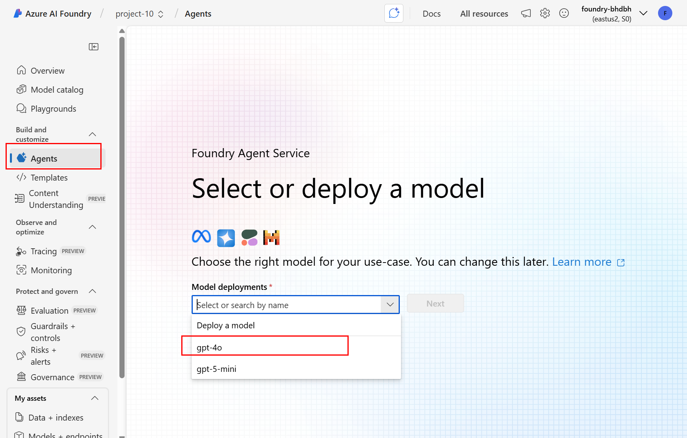

# NextGenAI Agents Workshop

Welcome to the repository dedicated to the **Agent to Agent and Agent to Tool: Building Next Gen Reasoning Systems on Azure** workshop!

This repository contains code samples and instructions to help you go through the workshop exercises.

## Prerequisites

### Sign into the Azure AI Foundry portal

1. Open a browser window and navigate to the [Azure AI Foundry portal](https://ai.azure.com/).

    

2. Sign in with your Azure account credentials. The user name should be `fllm-labuser-NN@foundationallm.ai`, where `NN` is your assigned number during the workshop. The password will also be provided during the workshop.

>[!IMPORTANT]
>You will be asked to provide additional settings to keep the >account secure. Please make sure you skip the multi-factor >authentication (MFA) setup, as this is not supported in the >workshop environment.

3. Select `Next` on the `Let's keep your account secure` page.

    

    Select `Skip setup`.

    

4. After signing in, you will be presented with the list of Azure AI Foundry projects. Select the project named `project-NN`, where `NN` is your assigned number during the workshop.

    

>[!IMPORTANT]
Your account has the required access only to the `project-NN` project. Please make sure you select the correct project, otherwise you will see multiple permissions errors and will not be able to complete the exercises.

5. After selecting the project, you are ready to start using Azure AI Foundry.

   

### Set up your local environment (optional)

**Requirements:**

- Visual Studio Code (download [here](https://code.visualstudio.com/)). Make sure to install the `Python` and `Python Debugger` extensions for Visual Studio Code (search for "Python" and "Python Debugger" in the Extensions view and install the ones published by Microsoft).
- Python 3.11 or later (download [here](https://www.python.org/downloads/)).
- Azure CLI 2.77.0 (download [here](https://learn.microsoft.com/en-us/cli/azure/install-azure-cli)).

Once you have installed the prerequisites, follow these steps to set up your local environment:

1. Clone this repository to your local machine and open it in Visual Studio Code. You can use the following command in your terminal (make sure to run it in the directory where you want to clone the repository):

    ```cmd
    git clone https://github.com/foundationallm/nextgenai-agents-workshop NextGenAI-Agents-Workshop
    ```

2. In Visual Studio Code, select `CTRL+SHIFT+P` (or `CMD+SHIFT+P` on Mac) to open the command palette, then type `Python: Create Environment` and select it. When prompted, select `Venv` as the environment type and `Python 3.11` (or above) as the base interpreter. When prompted to select dependencies to install, select `requirements.txt` and then select `OK`. This will trigger the creation of a new Python virtual environment named `.venv` and install the required dependencies. The process may take a few minutes and the progress will be shown in a popup in the bottom right corner of Visual Studio Code (you can select `Show logs` if want to see more details).

    If you prefer to create the virtual environment manually, you can do so by following these steps:
    - Open the Powershell terminal in Visual Studio Code (View > Terminal) and create a new Python virtual environment by running the following command (if it's a PowerShell terminal):

        ```pwsh
        & 'C:\Program Files\Python311\python.exe' -m venv .venv
        ```

        Make sure to adjust the path to `python.exe` if your Python installation is in a different location.

    - Once your virtual environment is created, activate it by running the following command:

        ```pwsh
        .\.venv\Scripts\activate
        ```

    - Install the required dependencies by running the following command:

        ```pwsh
        pip install -r requirements.txt
        ```

3. Configure the environment variables required to run the code samples. You can do this by creating a `.env` file in the root of the repository (next to `README.md`) and adding the following lines to it:
   
    ```txt
    PROJECT_ENDPOINT=<project_endpoint>
    MODEL_DEPLOYMENT_NAME=gpt-4o
    ```

    Make sure to replace `<project_endpoint>` with the actual project endpoint URL. You can find the project endpoint URL in the Azure AI Foundry portal by selecting `Overview` in the left-hand menu and then copying the value under `Azure AI Foundry project endpoint`:

    

4. Log in to your Azure account using the Azure CLI by running the following command in the terminal:

    ```pwsh
    az login
    ```

    This will open a popup where you must select the `Work or school account` option and then sign in with your Azure account credentials. Make sure to use the same account you used to sign in to the Azure AI Foundry portal.

>[!IMPORTANT]
>You will be asked to provide additional settings to keep the >account secure. Please make sure you skip the multi-factor >authentication (MFA) setup, as this is not supported in the >workshop environment (see the [Sign into the Azure AI Foundry portal](#sign-into-the-azure-ai-foundry-portal) section for more details).

5. If you are prompted to select a subscription, make sure to select the subscription named `FoundationaLLM Demos` with the subscription ID `d2602cd1-e330-4e81-8edf-712f8a2f4130`.

### Running a Python file in the local environment (optional)

Before running any Python file in this repo, make sure you complete the steps in the [Set up your local environment (optional)](#set-up-your-local-environment-optional) section.

To run a Python file in the local environment, follow these steps:

1. In Visual Studio Code, open a terminal (View > Terminal) and make sure your Python virtual environment is activated. Also, make sure you are in the root directory of the repository (where `README.md` is located).

2. Run the Python file by using the following command:

    ```pwsh
    python <file_name>.py
    ```

    Make sure to replace `<file_name>` with the actual name of the Python file you want to run (e.g., `first_agent.py`).

### Debugging a Python file in the local environment (optional)

Before debugging any Python file in this repo, make sure you complete the steps in the [Set up your local environment (optional)](#set-up-your-local-environment-optional) section.

If you want to run the Python files in debug mode so you can understand in more detail how they work, you can do so by following these steps:

1. In Visual Studio Code, open the Python file you want to debug.

2. Set a breakpoint by clicking in the gutter to the left of the line number where you want to pause execution. The recommended line to set a breakpoint is the line that contains the `project_client = AIProjectClient(` method call.

3. Select `CTRL+SHIFT+D` (or `CMD+SHIFT+D` on Mac) to open the command selector and type `Python Debugger: Python Debugger: Debug Python file` and select it. This will start the debugger and run the Python file in debug mode.

## Exercise 1: Create a simple agent (witty cat) in AI Foundry

This exercise is performed in the Azure AI Foundry portal. Before starting the exercise, please make sure you have completed the [Sign into the Azure AI Foundry portal](#sign-into-the-azure-ai-foundry-portal) instructions from the [Prerequisites](#prerequisites) section. The instructions assume you are already signed into the Azure AI Foundry portal and have selected your project.

To complete this exercise, follow these steps:

1. In the left-hand menu, select `Agents`. If prompted, select the `gpt-4o` model deployment to use with the agents.

    

2. Select `+ New agent` to create a new agent.

    

    The new agent will be created with a default name and will be displayed in the list of agents. Select `Try in playground` to open the agent in the playground.

3. In the playground, add the following text to the `Instructions` property of the agent:

   ```txt
   You are a witty and funny agent that takes the perspective of a cat observing humans performing daily activities. You are both OCD and critical about what you see the humans doing, and you are more than happy to share your opinion on that. 
   ```

   and then submit the following prompt (referenced as user query in the playground):

   ```txt
   We are all attending a conference for AI software development. What do you think about that?
    ```

    

4. Submit other prompts to see how the agent responds. Optionally, you can modify the `Instructions` property of the agent to see how it affects the responses.

## Exercise 2: Create a simple agent (Fibonacci sequence) with Python and AI Foundry

This exercise is a code-only exercise. Before starting the exercise, please make sure you have completed the [Prerequisites](#prerequisites) section (including the optional [Setup your local environment](#set-up-your-local-environment-optional)).

Run [first_agent.py](./first-agent.py) using the instructions from the [Running a Python file in the local environment (optional)](#running-a-python-file-in-the-local-environment-optional) section. Optionally, you can run the file in debug mode using the instructions from the [Debugging a Python file in the local environment (optional)](#debugging-a-python-file-in-the-local-environment-optional) section.

## Exercise 3: Create an agent with Code Interpreter in AI Foundry

This exercise is performed in the Azure AI Foundry portal. Before starting the exercise, please make sure you have completed the [Sign into the Azure AI Foundry portal](#sign-into-the-azure-ai-foundry-portal) instructions from the [Prerequisites](#prerequisites) section. The instructions assume you are already signed into the Azure AI Foundry portal and have selected your project.

To complete this exercise, follow these steps:

1. Create a new agent in the Azure AI Foundry portal and use the following text for the instructions (see the steps in the [Exercise 1: Create a simple agent (witty cat) in AI Foundry](#exercise-1-create-a-simple-agent-witty-cat-in-ai-foundry) section for reference):

    ```txt
    You politely help with math questions.
    ```

2. In the `Actions` section select `+ Add` action and then select `Code interpreter` from the list of available tools.

    

3. Save the code interpreter action without adding any files.

4. In the playground, submit the following prompt (referenced as user query in the playground):

    ```txt
    Use python code to compute the first 10 digits of the Gray code cycle.
    ```

    

## Exercise 4: Create an agent with Code Interpreter with Python and AI Foundry

This exercise is a code-only exercise. Before starting the exercise, please make sure you have completed the [Prerequisites](#prerequisites) section (including the optional [Setup your local environment](#set-up-your-local-environment-optional)).

Run [agent-code-interpreter.py](./agent-code-interpreter.py) using the instructions from the [Running a Python file in the local environment (optional)](#running-a-python-file-in-the-local-environment-optional) section. Optionally, you can run the file in debug mode using the instructions from the [Debugging a Python file in the local environment (optional)](#debugging-a-python-file-in-the-local-environment-optional) section.

## Exercise 5: Create an agent with Azure REST API Specs MCP tool with Python and AI Foundry

This exercise is a code-only exercise. Before starting the exercise, please make sure you have completed the [Prerequisites](#prerequisites) section (including the optional [Setup your local environment](#set-up-your-local-environment-optional)).

Run [agent-mcp.py](./agent-mcp.py) using the instructions from the [Running a Python file in the local environment (optional)](#running-a-python-file-in-the-local-environment-optional) section. Optionally, you can run the file in debug mode using the instructions from the [Debugging a Python file in the local environment (optional)](#debugging-a-python-file-in-the-local-environment-optional) section.

## Exercise 6: Create an agent with MS Learn MCP tool with Python and AI Foundry

This exercise is a code-only exercise. Before starting the exercise, please make sure you have completed the [Prerequisites](#prerequisites) section (including the optional [Setup your local environment](#set-up-your-local-environment-optional)).

Run [agent-mcp-mslearn.py](./agent-mcp-mslearn.py) using the instructions from the [Running a Python file in the local environment (optional)](#running-a-python-file-in-the-local-environment-optional) section. Optionally, you can run the file in debug mode using the instructions from the [Debugging a Python file in the local environment (optional)](#debugging-a-python-file-in-the-local-environment-optional) section.

## Exercise 7: Create an agent (weather) with OpenAPI tools in AI Foundry

This exercise is performed in the Azure AI Foundry portal. Before starting the exercise, please make sure you have completed the [Sign into the Azure AI Foundry portal](#sign-into-the-azure-ai-foundry-portal) instructions from the [Prerequisites](#prerequisites) section. The instructions assume you are already signed into the Azure AI Foundry portal and have selected your project.

To complete this exercise, follow these steps:

1. Create a new agent in the Azure AI Foundry portal and use the following text for the instructions (see the steps in the [Exercise 1: Create a simple agent (witty cat) in AI Foundry](#exercise-1-create-a-simple-agent-witty-cat-in-ai-foundry) section for reference):

    ```txt
    You are a helpful agent.
    ```

2. In the `Actions` section select `+ Add` action and then select `OpenAPI 3.0 specified tool` from the list of available tools. Enter the following values in the `Tool details` section and then select `Next` to advance:

   - **Name**: `get_weather`.
   - **Description**: `Retrieve weather information`.

3. In the `Define schema` section, paste the contents of the [weather_openapi.json](./weather_openapi.json) and then select `Next` to advance.

4. In the `Review` section select `Create tool` to create the tool.

5. In the playground, submit the following prompt (referenced as user query in the playground):

    ```txt
    What's the weather in Orlando, Florida?
    ```

## Exercise 8: Create an agent (holidays) with OpenAPI tool with Python and AI Foundry

This exercise is a code-only exercise. Before starting the exercise, please make sure you have completed the [Prerequisites](#prerequisites) section (including the optional [Setup your local environment](#set-up-your-local-environment-optional)).

Run [agent-openapi-holidays.py](./agent-openapi-holidays.py) using the instructions from the [Running a Python file in the local environment (optional)](#running-a-python-file-in-the-local-environment-optional) section. Optionally, you can run the file in debug mode using the instructions from the [Debugging a Python file in the local environment (optional)](#debugging-a-python-file-in-the-local-environment-optional) section.

## Exercise 9: Create an agent (bing search) with AI Foundry

This exercise will be presented as an interactive demo by the workshop instructor.

## Exercise 10: Create an agent (bing custom search) with AI Foundry

This exercise will be presented as an interactive demo by the workshop instructor.

## Exercise 11: Create an agent (bing custom search) with AI Foundry and Python

This exercise will be presented as an interactive demo by the workshop instructor.

## Exercise 12: Creating an agent with Fabric Data Agent in AI Foundry

This exercise is performed in the Azure AI Foundry portal. Before starting the exercise, please make sure you have completed the [Sign into the Azure AI Foundry portal](#sign-into-the-azure-ai-foundry-portal) instructions from the [Prerequisites](#prerequisites) section. The instructions assume you are already signed into the Azure AI Foundry portal and have selected your project.

To complete this exercise, follow these steps:

1. Create a new agent in the Azure AI Foundry portal and use the following text for the instructions (see the steps in the [Exercise 1: Create a simple agent (witty cat) in AI Foundry](#exercise-1-create-a-simple-agent-witty-cat-in-ai-foundry) section for reference):

    ```txt
    You are a helpful agent.
    ```

2. In the `Knowledge` section select `+ Add` and then select `Microsoft Fabric` from the list of available tools.

3. In the `Choose an existing Microsoft Fabric connection` dialog, select the `Fabric-TestAgent01` connection and then select `Connect`.

4. In the playground, submit the following prompt (referenced as user query in the playground):

    ```txt
    What is the latest closing price for MSFT?
    ```

## Exercise 13: Create connected agents in AI Foundry

This exercise is performed in the Azure AI Foundry portal. Before starting the exercise, please make sure you have completed the [Sign into the Azure AI Foundry portal](#sign-into-the-azure-ai-foundry-portal) instructions from the [Prerequisites](#prerequisites) section. The instructions assume you are already signed into the Azure AI Foundry portal and have selected your project.

To complete this exercise, follow these steps:

1. Create a new agent in the Azure AI Foundry portal and use the following text for the instructions (see the steps in the [Exercise 1: Create a simple agent (witty cat) in AI Foundry](#exercise-1-create-a-simple-agent-witty-cat-in-ai-foundry) section for reference):

    ```txt
    You are a helpful agent that can delegate tasks to other agents as needed.
    ```

2. In the `Connected agents` section select `+ Add` and then provide the following values in the `Adding a connected agent` dialog:

   - **Agent**: Select the agent you created in the [Exercise 1: Create a simple agent (witty cat) in AI Foundry](#exercise-1-create-a-simple-agent-witty-cat-in-ai-foundry) section.
   - **Alias**: `cat_agent`.
   - **Detail the steps to activate the agent**: `An agent that takes the perspective of a cat observing humans performing daily activities`.

3. In the playground, submit the following prompt (referenced as user query in the playground):

    ```txt
    Thru the eyes of a cat, how do you see us at this AI tech conference?
    ```
